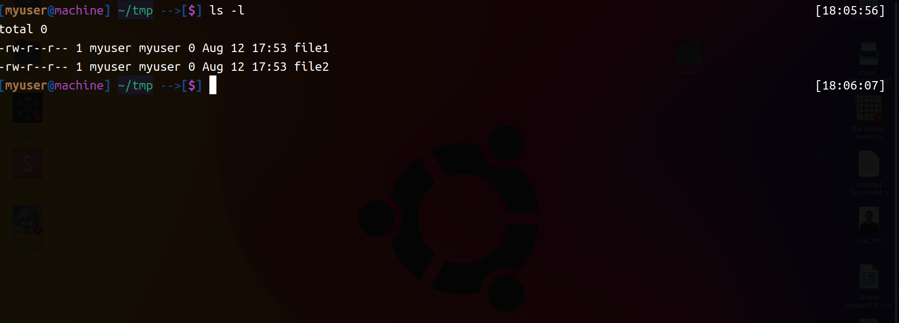

# Theballmarcus's Oh-My-Zsh

### Theballmarcus ZSH Theme
#### Preview:

#### Features:
It works with the nordvpn plugin. Uncomment the last line to activate it.

#### Install:
Just copy the theme into oh-my-zsh:  
`cp theballmarcus.zsh-theme ~/.oh-my-zsh/themes/`  
and change .zshrc's ZSH_THEME="" line to  
`ZSH_THEME="theballmarcus"`

### Nordpvn ZSH Plugin
#### Features:
Addsa bunch of aliases:
* nlc='nordvpn countries'
* nlci='nordvpn cities'
* noc='nordvpn connect'
* nod='nordvpn disconnect'
* nos='nordvpn status'
* nov='nordvpn -v'
* nol='output=\$(nordvpn login); url="\$

#### Enable status loop:
Can also display if you are connected in right top corner of terminal if enabled by the theme. Enabling it is easy - just add `loop_nordvpn_info;` to buttom of themes file. 

#### Installation:
To install the plugin:

`cp -r nordvpn ~/.oh.my.zsh/plugins`

then add nordvpn to plugins line in .zshrc
It can look like this:
`plugins=(git nordvpn)`